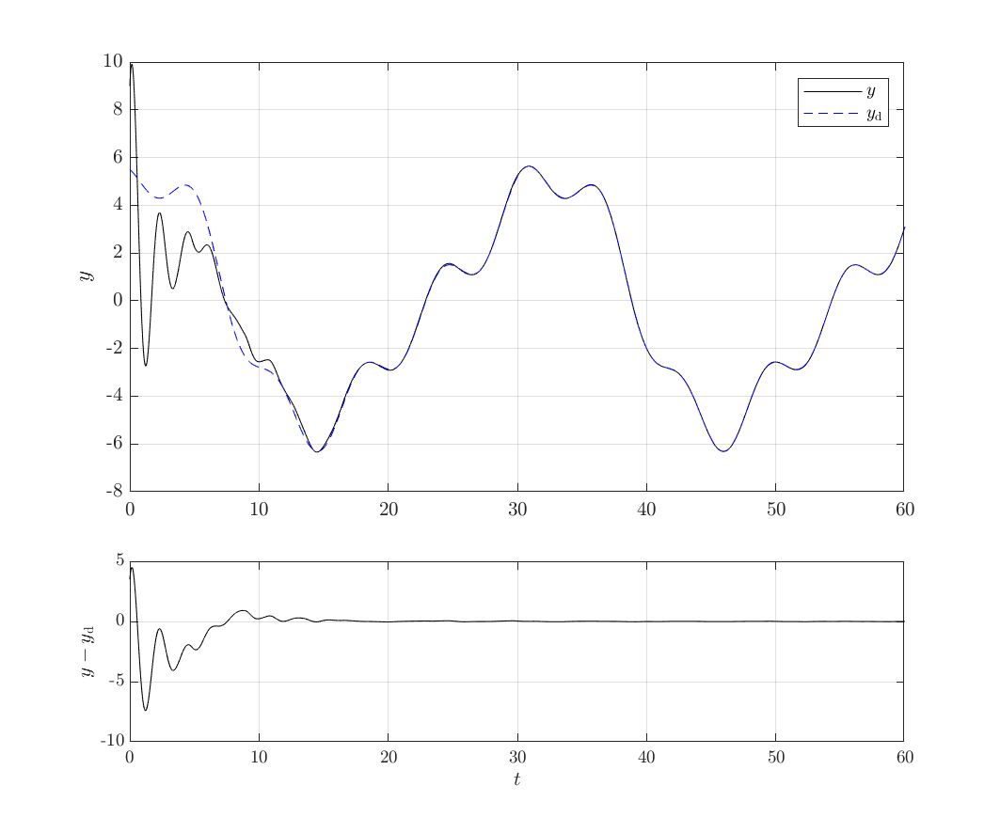
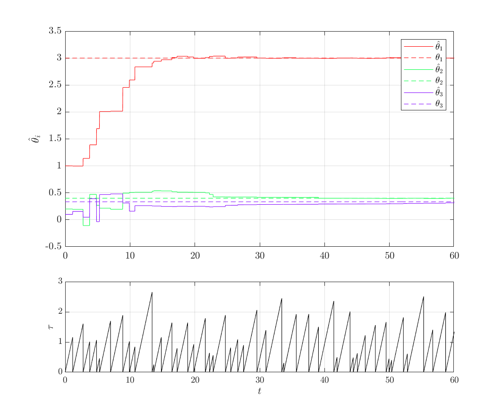

# A hybrid adaptive inverse for uncertain SISO linear plants with full relative degree

_Matteo Cocetti, Matteo Ragni, Sophie Tarbouriech, Luca Zaccarian_

### Abstract

We propose a hybrid adaptive feed-forward regulator for single input single 
output linear plants with a full relative degree. The scheme includes an adaptive 
law that estimates the inverse of the plant and provides a feed-forward control 
calculated on the basis of the desired output and its derivatives. 

The adaptation is performed during discrete time events, called **jumps**, 
while the feed-forward action is continuous. This combination leads to a 
full hybrid system. 

The advantage of this framework is a conceptual separation between the 
adaptation dynamics, which is **discrete**, and the plant dynamics, which 
is **continuous**. 

Under an assumption of a persistence of excitation, we show through 
examples that the output asymptotically tracks the desired reference and that 
the estimate of the parameters of the inverse converges.

### Example Repository

The repository contains the source code and the simulink model for the example
presented in the article.

**Requirements**:

 * Matlab/Simulink (R2018a)
 * Matlab Control Systems Toolbox
 * Matlab Symbolic Toolbox

**Usage**:

Open the file `example.slx` and run the simulation. Data are prepared through
`initSim`, called automatically at simulation start.

Edit `initSim` in order to test a different plant / initial conditions / filters.

### Proposed Example

**Plant**:
```
x' = A x + B u
y  = C x

[ A | B ]      [ 0       1 | 0 ]
[ --+-- ] =  = [ -w²  -2zw | 1 ]
[ C |   ]      [ ----------+-- ]
               [ k       0 |   ]

w = 3
k = 3
z = 0.2

x0 = [ 3, 4]'
```

**Filters**:
```
eig(Λ) = (-50 -75 -100)
Φ      = [ 0 0 1 ]'
```

**Adaptation**:
```
γ    = 0.5
τmin = 0.25
τmax = 3.00

θ0 = [ 1, 0.2, 0.1 ]'
```

**Reference**:
```
r(t) := 5 cos(t/5) + cos(t + ?/3) + sin(2t/5)
```
(derivative are computed symbolically using the Symbolic Toolbox)

### Results





### Cite

The paper is currently under review for ACC 2019. Citation instruction will be provided as soon as we receive an acceptance notification.
